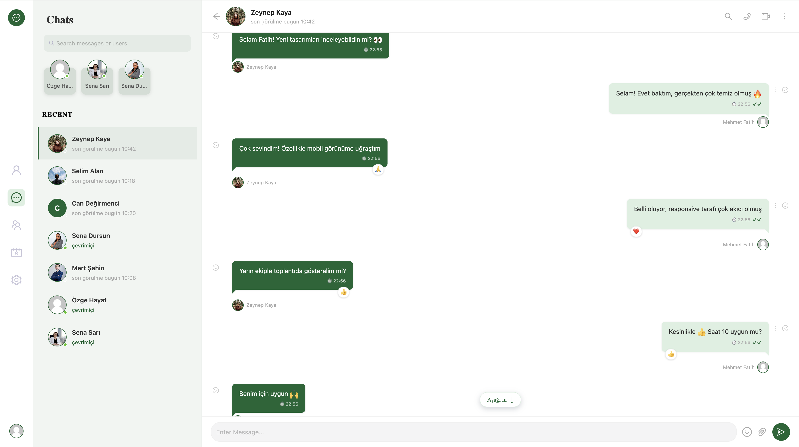
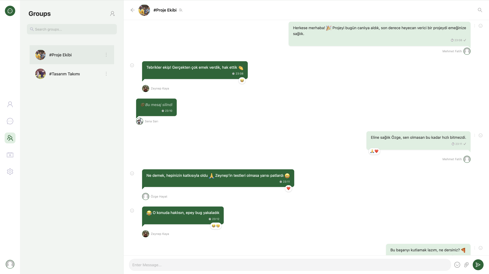
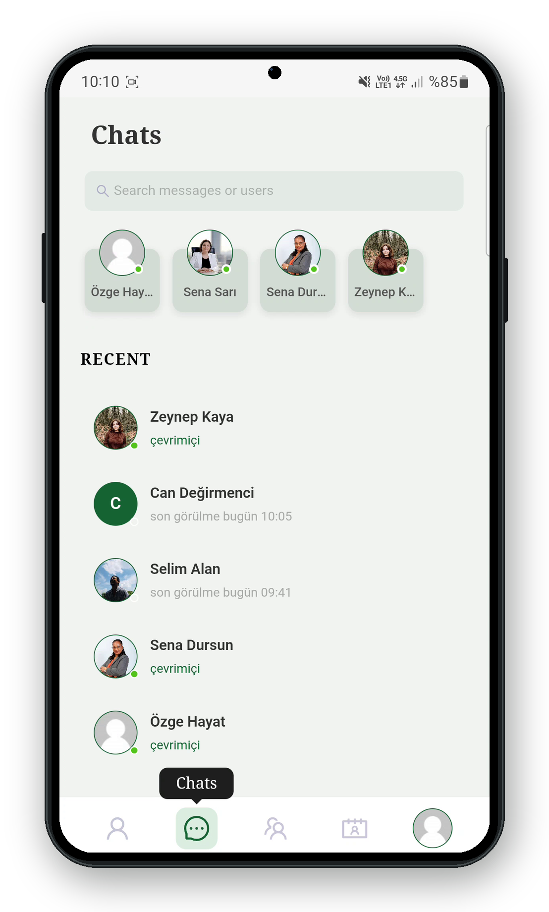

# 💬 ChatFlow

> Gerçek zamanlı, tam donanımlı bir mesajlaşma uygulaması — WhatsApp/Telegram deneyimini modern web teknolojileriyle sunar.

**.NET 9 + SignalR** güçlü bir backend, **React + TypeScript** akıcı bir arayüz ile bireysel ve grup sohbetleri, anlık bildirimler, dosya paylaşımı ve daha fazlasını gerçek zamanlı olarak destekler.

<p align="center">
  <a href="https://chatflow-knzm.onrender.com"><b>🌐 Canlı Demo</b></a> &nbsp;•&nbsp;
  <a href="https://chatflow-knzm.onrender.com/swagger"><b>📖 API (Swagger)</b></a>
</p>

> **Not:** Uygulama ücretsiz sunucuda barındırıldığından, ilk açılışta sunucu "uyandırma" nedeniyle 30-60 saniye gecikme olabilir. İlk yüklemeden sonra akıcı çalışır.

## 🔑 Test Kullanıcıları

Canlı demoyu hızlıca deneyebilmeniz için aşağıdaki test kullanıcılarını kullanabilirsiniz.

> **Şifre:** `123456` (Tüm kullanıcılar için aynıdır.)

| Kullanıcı Adı |
|--------------|
| `mfatih` |
| `zeynepkaya` |
| `selimalan` |
| `senasari` |
| `mertsahin` |

> 💡 **Not:** Listede bulunan tüm kullanıcılar için şifre `123456`'dır. İstediğiniz kullanıcıyla giriş yaparak birebir mesajlaşma, grup sohbetleri ve diğer özellikleri test edebilirsiniz.

---

## 📸 Ekran Görüntüleri

### 💬 Birebir Mesajlaşma

<p align="center">
  
</p>

---

### 👥 Grup Sohbeti

<p align="center">
  
</p>

---

### 📱 Mobil Görünüm

<p align="center">
  
</p>


---

## 🎥 Tanıtım Videoları

### Genel Kullanım (Masaüstü)
Giriş, profil, sohbet ve grup yönetimi.


### Mobil Kullanım
Responsive mobil arayüz.


### Gerçek Zamanlı Mesajlaşma (İki Kullanıcı)
İki kullanıcının aynı anda mesajlaşması — mesajlar, mesaj silme, okundu bilgisi ve yazıyor göstergesi anlık yansır.


## ✨ Özellikler

### Mesajlaşma
- **Gerçek zamanlı mesajlaşma** — SignalR (WebSocket) ile anlık mesaj iletimi, sayfa yenilemeye gerek yok
- **Grup sohbetleri** — grup oluşturma, üye ekleme/çıkarma, yönetici atama
- **Okundu / iletildi bilgisi** — çift tik sistemi, bireysel ve grup mesajları için okunma takibi
- **Yazıyor göstergesi** — karşı taraf yazarken anlık "yazıyor..." animasyonu
- **Dosya ve görsel paylaşımı** — Cloudinary ile resim ve dosya yükleme, önizleme
- **Emoji desteği** — zengin emoji seçici
- **Mesaj arama** — sohbet içinde metin arama ve eşleşmeler arası gezinme
- **Sayfalama** — geçmiş mesajlar kaydırıldıkça otomatik yüklenir (performans için)

### Anlık (Real-time) Durum Güncellemeleri
- **Çevrimiçi durumu** — kullanıcıların anlık online/offline durumu (çoklu sekme ve sayfa yenilemeye dayanıklı)
- **Yazıyor göstergesi** — karşı taraf yazarken anlık "yazıyor..." animasyonu
- **Anlık bildirimler** — yeni mesaj, arkadaşlık isteği ve gruba eklenme bildirimleri sayfa yenilemeden düşer
- **Anlık profil fotoğrafı değişimi** — bir kullanıcı fotoğrafını değiştirdiğinde tüm açık oturumlarda anında güncellenir
- **Anlık engelleme** — engelleme/engel kaldırma işlemleri her iki tarafta da anında yansır

### Kullanıcı & Sosyal
- **Arkadaşlık sistemi** — istek gönderme, kabul/ret, arkadaş listesi
- **Kullanıcı engelleme** — engellenen kullanıcılarla mesajlaşma engellenir
- **Profil yönetimi** — ad, biyografi, profil fotoğrafı düzenleme
- **Güvenlik** — şifre değiştirme, oturum yönetimi
- **Sohbet silme** — WhatsApp mantığıyla sohbet gizleme (yeni mesaj gelince geri döner)

### Deneyim
- **Tam mobil uyumlu (responsive)** — masaüstü ve mobil için özel tasarlanmış arayüz
- **JWT tabanlı kimlik doğrulama** — güvenli, HttpOnly cookie ile oturum
- **"Beni hatırla"** — uzun süreli oturum seçeneği

---

## 🛠️ Teknoloji Yığını

### Backend (`ChatFlow-API`)
| Teknoloji | Kullanım |
|-----------|----------|
| **.NET 9** | Ana framework |
| **ASP.NET Core Web API** | RESTful API katmanı |
| **SignalR** | Gerçek zamanlı çift yönlü iletişim (WebSocket) |
| **Entity Framework Core** | ORM, veritabanı erişimi |
| **PostgreSQL** | İlişkisel veritabanı |
| **ASP.NET Core Identity** | Kullanıcı yönetimi ve kimlik doğrulama |
| **JWT (JSON Web Token)** | Token tabanlı yetkilendirme |
| **Cloudinary** | Bulut tabanlı medya (resim/dosya) depolama |
| **Swagger / OpenAPI** | API dokümantasyonu |

### Frontend (`chatflow-client`)
| Teknoloji | Kullanım |
|-----------|----------|
| **React 19** | UI kütüphanesi |
| **TypeScript** | Tip güvenliği |
| **Redux Toolkit** | Global state yönetimi |
| **Ant Design** | UI bileşen kütüphanesi |
| **Vite** | Build aracı ve geliştirme sunucusu |
| **Axios** | HTTP istemcisi |
| **@microsoft/signalr** | SignalR istemcisi |
| **emoji-picker-react** | Emoji seçici |

### Altyapı & DevOps
| Teknoloji | Kullanım |
|-----------|----------|
| **Docker** | Çok aşamalı (multi-stage) konteynerizasyon |
| **Render** | Uygulama barındırma (tek servis) |
| **Neon** | Serverless PostgreSQL barındırma |
| **k6** | Yük ve performans testi |

---

## 🏗️ Mimari

ChatFlow, **tek servis (single-service)** mimarisiyle dağıtılır: React uygulaması build edilip .NET backend'in `wwwroot` klasörüne gömülür. Böylece frontend ve API **aynı origin** üzerinden sunulur.

```
┌─────────────────────────────────────────────┐
│              Render (Docker)                 │
│  ┌───────────────────────────────────────┐  │
│  │         ASP.NET Core (.NET 9)          │  │
│  │  ┌─────────────┐   ┌────────────────┐  │  │
│  │  │  REST API   │   │  SignalR Hub   │  │  │
│  │  │  /api/*     │   │  /hubs/chat    │  │  │
│  │  └─────────────┘   └────────────────┘  │  │
│  │  ┌───────────────────────────────────┐ │  │
│  │  │  wwwroot/ (React build - SPA)     │ │  │
│  │  └───────────────────────────────────┘ │  │
│  └───────────────────────────────────────┘  │
└───────────────────┬─────────────────────────┘
                    │
         ┌──────────┴──────────┐
         │                     │
   ┌─────▼─────┐        ┌──────▼──────┐
   │   Neon    │        │  Cloudinary │
   │PostgreSQL │        │  (medya)    │
   └───────────┘        └─────────────┘
```

**Bu mimarinin avantajı:** Frontend ve backend aynı domain'de olduğu için, kimlik doğrulama cookie'leri "same-origin" olarak çalışır — cross-site cookie kısıtlamaları ve CORS karmaşası ortadan kalkar, güvenlik artar.

Çok aşamalı `Dockerfile` şunları yapar:
1. **Node aşaması** — React uygulamasını build eder (`dist`)
2. **.NET SDK aşaması** — backend'i publish eder
3. **Runtime aşaması** — backend + React build'i birleştirip tek imaj oluşturur

---

## 📊 Performans (Yük Testi)

Canlı ortamda **k6** ile iki senaryo test edildi (ücretsiz sunucu: 0.5 GB RAM, paylaşımlı CPU):

### Gerçekçi Kullanım (15 eşzamanlı kullanıcı, token tabanlı oturum)
| Metrik | Sonuç |
|--------|-------|
| Hata oranı | **%0** |
| Ortalama yanıt süresi | **~105 ms** |
| p95 yanıt süresi | **136 ms** |
| Toplam istek | 623 (tamamı başarılı) |

Tüm API çağrıları (sohbet listesi, kullanıcılar, arkadaşlar, mesajlar) ortalama **~100 ms** yanıt süresiyle, **%0 hata** ile tamamlandı — ücretsiz altyapıda production kalitesinde performans.

### Load Testi (50 eşzamanlı kullanıcı, her istekte login)
| Metrik | Sonuç |
|--------|-------|
| Hata oranı | **%0** |
| Toplam istek | 1196 (tamamı başarılı) |

Yoğun yük altında bile **hiç istek düşmedi**. CPU-yoğun şifre hash'leme (Identity) beklenen darboğaz olarak tespit edildi; yatay ölçekleme veya daha güçlü bir instance ile yanıt süreleri kolayca düşürülebilir.

**Sonuç:** Sistem, yük altında tam kararlılık (%0 hata) gösterdi; performans sınırı yalnızca ücretsiz sunucunun donanım kapasitesiyle sınırlıdır.

---

## 🚀 Kurulum (Yerel Geliştirme)

### Ön Koşullar
- [.NET 9 SDK](https://dotnet.microsoft.com/download)
- [Node.js 20+](https://nodejs.org/)
- [PostgreSQL](https://www.postgresql.org/) (veya Docker ile)
- [Cloudinary](https://cloudinary.com/) hesabı (medya yükleme için)

### Backend

```bash
cd ChatFlow-API

# Bağımlılıkları yükle
dotnet restore

# Gizli bilgileri ayarla (user secrets)
dotnet user-secrets set "ConnectionStrings:DefaultConnection" "Host=localhost;Database=chatflowdb;Username=postgres;Password=SIFRE"
dotnet user-secrets set "AppSettings:Secret" "en-az-32-karakterlik-gizli-anahtar"
dotnet user-secrets set "Cloudinary:CloudName" "cloud-adiniz"
dotnet user-secrets set "Cloudinary:ApiKey" "api-key"
dotnet user-secrets set "Cloudinary:ApiSecret" "api-secret"

# Veritabanı migration'larını uygula
dotnet ef database update

# Çalıştır
dotnet watch run
```

Backend `http://localhost:5017` adresinde çalışır. Swagger: `http://localhost:5017/swagger`

### Frontend

```bash
cd chatflow-client

# Bağımlılıkları yükle
npm install

# .env dosyası oluştur
echo "VITE_API_BASE_URL=http://localhost:5017/api/" > .env
echo "VITE_IMAGE_BASE_URL=http://localhost:5017" >> .env

# Çalıştır
npm run dev
```

Frontend `http://localhost:5173` adresinde çalışır.

---

## 📁 Proje Yapısı

```
ChatFlow/
├── Dockerfile                 # Çok aşamalı build (frontend + backend)
├── ChatFlow-API/              # Backend (.NET 9)
│   ├── Controllers/           # API endpoint'leri
│   ├── Hubs/                  # SignalR hub'ı (ChatHub)
│   ├── Models/                # Entity ve DTO'lar
│   ├── Service/               # İş mantığı servisleri
│   ├── Data/                  # DbContext
│   ├── Migrations/            # EF Core migration'ları
│   └── Program.cs             # Uygulama yapılandırması
│
└── chatflow-client/           # Frontend (React + TS)
    ├── src/
    │   ├── api/               # API istekleri + SignalR servisi
    │   ├── components/        # Yeniden kullanılabilir bileşenler
    │   ├── features/          # Özellik bazlı modüller (chats, groups, auth...)
    │   ├── store/             # Redux store
    │   ├── layouts/           # Ana layout (App)
    │   └── router/            # Rota tanımları
    └── vite.config.ts
```

---

## 👤 Geliştirici

**Mehmet Fatih Canıbek**

- LinkedIn: [linkedin.com/in/mehmet-fatih-canıbek-87620b335](https://www.linkedin.com/in/mehmet-fatih-canıbek-87620b335)
- GitHub: [@M-Fatih00](https://github.com/M-Fatih00)

---

<p align="center">
  <sub>Bu proje bir portfolyo çalışmasıdır. Geri bildirim ve öneriler için çekinmeden iletişime geçebilirsiniz.</sub>
</p>
